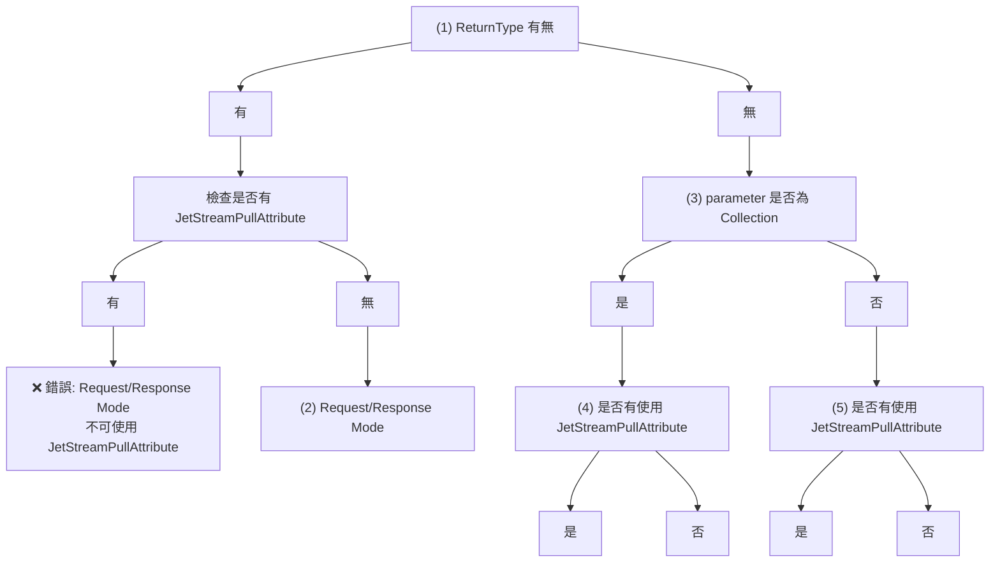

# AutoConvention ApplicationService 開發指南

本指南將說明如何使用 AutoConvention 來建立 ApplicationService，並展示如何進行依賴注入和理解決策樹的運作機制。

## 1. Application 的實作

### 1.1 基本結構

ApplicationService 需要繼承自 `NatsService` 基類，並實作對應的介面：

```csharp
// 介面定義
public interface IAuthorAppService
{
    Task<ErrorOr<AuthorResponse>> GetAuthorAsync(Guid id);
    Task<ErrorOr<AuthorResponse>> CreateAuthorAsync(CreateAuthorRequest request);
    Task<ErrorOr<AuthorResponse>> UpdateAuthorAsync(Guid id, UpdateAuthorRequest request);
    Task<ErrorOr<Success>> DeleteAuthorAsync(Guid id);
    Task PublishAuthorEventAsync(AuthorEvent authorEvent);
}

// 實作類別
public class AuthorAppService : NatsService, IAuthorAppService
{
    private readonly IAuthorRepository _authorRepository;
    private readonly IMapper _mapper;
    
    public AuthorAppService(
        IAuthorRepository authorRepository,
        IMapper mapper)
    {
        _authorRepository = authorRepository;
        _mapper = mapper;
    }
    
    [Subject("author.get")]
    public async Task<ErrorOr<AuthorResponse>> GetAuthorAsync(Guid id)
    {
        var author = await _authorRepository.GetByIdAsync(id);
        if (author is null)
        {
            return Error.NotFound("Author.NotFound", $"Author with id {id} not found");
        }
        
        return _mapper.Map<AuthorResponse>(author);
    }
    
    [Subject("author.create")]
    public async Task<ErrorOr<AuthorResponse>> CreateAuthorAsync(CreateAuthorRequest request)
    {
        var author = _mapper.Map<Author>(request);
        var createdAuthor = await _authorRepository.CreateAsync(author);
        
        return _mapper.Map<AuthorResponse>(createdAuthor);
    }
    
    [Subject("author.update")]
    public async Task<ErrorOr<AuthorResponse>> UpdateAuthorAsync(Guid id, UpdateAuthorRequest request)
    {
        var existingAuthor = await _authorRepository.GetByIdAsync(id);
        if (existingAuthor is null)
        {
            return Error.NotFound("Author.NotFound", $"Author with id {id} not found");
        }
        
        _mapper.Map(request, existingAuthor);
        var updatedAuthor = await _authorRepository.UpdateAsync(existingAuthor);
        
        return _mapper.Map<AuthorResponse>(updatedAuthor);
    }
    
    [Subject("author.delete")]
    public async Task<ErrorOr<Success>> DeleteAuthorAsync(Guid id)
    {
        var author = await _authorRepository.GetByIdAsync(id);
        if (author is null)
        {
            return Error.NotFound("Author.NotFound", $"Author with id {id} not found");
        }
        
        await _authorRepository.DeleteAsync(id);
        return Result.Success;
    }
    
    [Subject("author.event")]
    [JetStream]
    public async Task PublishAuthorEventAsync(AuthorEvent authorEvent)
    {
        // 事件發佈邏輯
        await Task.CompletedTask;
    }
}
```

### 1.2 關鍵特點

- **繼承 NatsService**：所有 ApplicationService 都必須繼承自 `NatsService`
- **Subject 屬性**：使用 `[Subject]` 屬性指定 NATS 主題名稱
- **ErrorOr 模式**：使用 `ErrorOr<T>` 進行錯誤處理
- **JetStream 支援**：使用 `[JetStream]` 屬性啟用持久化訊息

## 2. 如何進行 DI

### 2.1 Program.cs 設定

```csharp
var builder = WebApplication.CreateBuilder(args);

// 1. 設定 ServiceFramework
builder.Services.AddServiceFramework(options =>
{
    options.DefaultConnection = "bus";
    options.AddConnection("bus", "nats://localhost:4223")
        .WithCredFile(credFile)
        .WithSerializerRegistry(NatsDefaultSerializerRegistry.Default);
});

// 2. 啟用 AutoConvention
builder.Services.AddAutoConvention();

// 3. 註冊相關服務
builder.Services.AddSingleton<IAuthorRepository, InMemoryAuthorRepository>();
builder.Services.AddScoped<IAuthorAppService, AuthorAppService>();
builder.Services.AddAutoMapper(typeof(AuthorMappingProfile));

var app = builder.Build();

// 4. 啟用 AutoConvention 中介軟體
app.UseAutoConvention();

app.Run();
```

### 2.2 appsettings.json 設定

```json
{
  "AutoConvention": {
    "RoutePrefix": "nats",
    "UseExceptionHandler": true,
    "DefaultJetStreamEnable": true
  },
  "Logging": {
    "LogLevel": {
      "Default": "Information",
      "Microsoft.AspNetCore": "Warning"
    }
  }
}
```

### 2.3 自動服務發現

AutoConvention 會自動掃描所有繼承自 `NatsService` 的類別，並進行以下操作：

- 自動註冊為 Scoped 服務
- 自動對應實作介面 (IxxxService)
- 自動建立 NATS 訂閱
- 自動產生 REST API 端點

## 3. 解釋 Decision Tree

### 3.1 決策樹概覽

AutoConvention 使用決策樹來決定每個方法的訊息處理模式：



### 3.2 四種訊息模式

#### 3.2.1 Request/Response Mode (請求/回應模式)

**條件**：方法有回傳值

**特點**：
- 同步等待回應
- 適合 CRUD 操作
- 使用 ErrorOr 模式處理錯誤

**範例**：
```csharp
[Subject("author.get")]
public async Task<ErrorOr<AuthorResponse>> GetAuthorAsync(Guid id)
{
    // 實作邏輯
}
```

#### 3.2.2 Pub/Sub Push Mode with JetStream (推播模式)

**條件**：方法無回傳值且使用 JetStream

**特點**：
- 訊息持久化
- 適合事件發佈
- 可保證訊息傳遞

**範例**：
```csharp
[Subject("author.event")]
[JetStream]
public async Task PublishAuthorEventAsync(AuthorEvent authorEvent)
{
    // 事件發佈邏輯
}
```

#### 3.2.3 Classic Pub/Sub (傳統發佈/訂閱)

**條件**：方法無回傳值且 DefaultJetStreamEnable = false

**特點**：
- 高效能、低延遲
- 無訊息持久化
- 適合即時通知

**範例**：
```csharp
[Subject("notification.send")]
[JetStream(false)]
public async Task SendNotificationAsync(NotificationMessage message)
{
    // 通知邏輯
}
```

#### 3.2.4 Pull Mode with JetStream (拉取模式)

**條件**：使用 JetStreamPullAttribute

**特點**：
- 控制訊息消費速度
- 適合批次處理
- 可處理大量訊息

**範例**：
```csharp
[Subject("batch.process")]
[JetStreamPull]
public async Task ProcessBatchAsync(List<BatchItem> items)
{
    // 批次處理邏輯
}
```

### 3.3 決策樹規則

1. **有回傳值**：自動選擇 Request/Response 模式
2. **無回傳值**：進入 Pub/Sub 決策分支
3. **Collection 參數**：考慮是否使用 Pull 模式
4. **JetStreamPullAttribute**：強制使用 Pull 模式
5. **JetStreamSubject**：啟用 JetStream 持久化
6. **DefaultStreamEnabled**：預設 JetStream 行為

### 3.4 錯誤情況

決策樹會檢查以下錯誤情況：

- **Request/Response 模式不可使用 JetStreamPullAttribute**
- **Collection + JetStreamPullAttribute 不可同時使用 JetStreamSubject**
- **Pull Mode 需要 JetStream 環境**

## 4. 最佳實踐

### 4.1 命名慣例

- 介面：`IxxxAppService`
- 實作：`xxxAppService`
- Subject：使用小寫點號分隔 (例：`author.get`)

### 4.2 錯誤處理

統一使用 `ErrorOr<T>` 模式：

```csharp
// 成功回應
return successResult;

// 錯誤回應
return Error.NotFound("Resource.NotFound", "資源不存在");
return Error.Validation("Input.Invalid", "輸入資料無效");
```

### 4.3 依賴注入

- Repository 使用 Singleton 或 Scoped
- ApplicationService 使用 Scoped
- 避免在 ApplicationService 中直接存取資料庫

### 4.4 測試策略

```csharp
[Test]
public async Task GetAuthorAsync_WithValidId_ShouldReturnAuthor()
{
    // Arrange
    var authorId = Guid.NewGuid();
    var expectedAuthor = new Author { Id = authorId, Name = "Test Author" };
    _mockRepository.Setup(r => r.GetByIdAsync(authorId))
        .ReturnsAsync(expectedAuthor);

    // Act
    var result = await _authorAppService.GetAuthorAsync(authorId);

    // Assert
    result.IsError.Should().BeFalse();
    result.Value.Name.Should().Be("Test Author");
}
```

## 5. 總結

AutoConvention 提供了一個強大的框架來建立基於 NATS 的 ApplicationService，透過：

- **自動服務發現**：減少手動註冊工作
- **智能決策樹**：自動選擇最適合的訊息模式
- **統一錯誤處理**：使用 ErrorOr 模式
- **多種訊息模式**：支援各種使用場景

透過遵循本指南的實作模式，開發者可以快速建立可靠且高效的微服務架構。