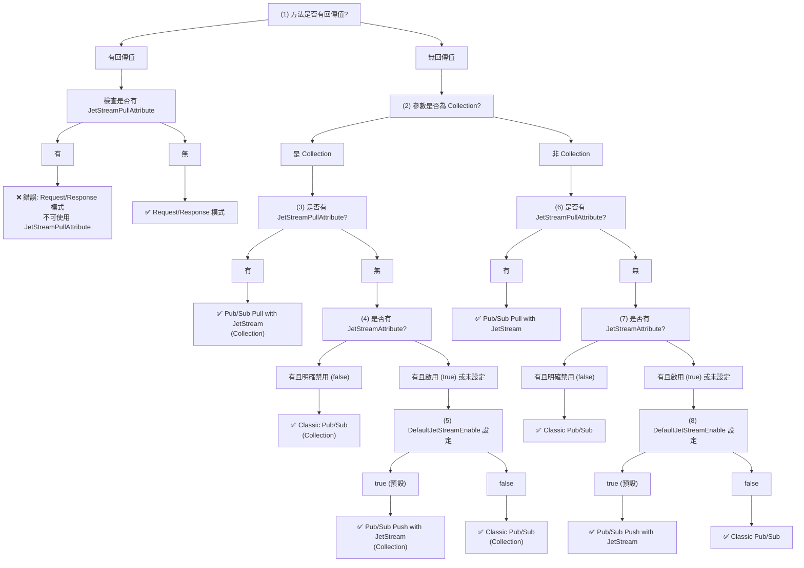

# ServiceFramework Application 實作指南

本指南將詳細說明如何在 EdgeSync ServiceFramework 中實作 Application，並比較 Legacy 模式與 Auto-Convention 模式的差異。

## 目錄
1. [架構概覽](#架構概覽)
2. [Legacy 模式 (BookStore)](#legacy-模式-bookstore)
3. [Auto-Convention 模式 (AuthorSystem)](#auto-convention-模式-authorsystem)
4. [Optional 範例 (EmailSystem)](#optional-範例-emailsystem)
5. [模式比較](#模式比較)
6. [最佳實踐](#最佳實踐)
7. [遷移指南](#遷移指南)

## 架構概覽

ServiceFramework 採用 Clean Architecture 架構，包含以下層級：

+ Legacy
```
App/
├── Domain/              # 實體、規範、錯誤定義
├── Application/         # 業務邏輯、DTOs、應用服務
├── Infrastructure/      # 資料存取實作
├── Nats.Api/            # NATS 服務處理器
├── Nats.Client/         # NATS 客戶端
└── Web.Api/             # HTTP API
```

+ Auto-Convention
```
App/
├── Domain/              # 實體、規範、錯誤定義
├── Application/         # 業務邏輯、DTOs、應用服務
├── Infrastructure/      # 資料存取實作
└── Host/                # 服務主機
```

## Legacy 模式 (BookStore)

### 1. Application Service 實作

Legacy 模式中，Application Service 是純粹的業務邏輯層，不包含 NATS 相關程式碼：

```csharp
// BookStore.Application/Services/BookAppService.cs
public class BookAppService : IBookAppService
{
    private readonly IBookRepository _bookRepository;
    private readonly IMapper _mapper;

    public BookAppService(IBookRepository bookRepository, IMapper mapper)
    {
        _bookRepository = bookRepository;
        _mapper = mapper;
    }

    public async Task<ErrorOr<BookDto>> GetAsync(Guid id)
    {
        var book = await _bookRepository.GetAsync(id);
        if (book is null)
        {
            return BookErrors.NotFound;
        }
        return _mapper.Map<BookDto>(book);
    }

    public async Task<ErrorOr<BookDto>> CreateAsync(CreateBookDto input)
    {
        var result = Book.Create(input.Title, input.Author, input.ISBN, input.Price, input.Stock);
        if (result.IsError)
        {
            return result.Errors;
        }

        var book = result.Value;
        var createdBook = await _bookRepository.InsertAsync(book);
        return _mapper.Map<BookDto>(createdBook);
    }

    // 其他 CRUD 方法...
}
```

### 2. NATS Service Handler 實作

需要建立獨立的 ServiceHandler 來處理 NATS 訊息：

```csharp
// BookStore.Nats.Api/ServiceHandlers/BookServiceHandler.cs
public class BookServiceHandler : ServiceHandler
{
    private readonly IBookAppService _bookAppService;
    private readonly JsonSerializerOptions _jsonOptions;

    public override string ServiceName => "bookstore";
    public override string ServiceVersion => "1.0.0";
    public override string QueueGroup => "bookstore-queue";

    public BookServiceHandler(
        ILogger<BookServiceHandler> logger,
        IJetStreamClientFactory factory,
        IBookAppService bookAppService)
        : base(logger, factory, "bus")
    {
        _bookAppService = bookAppService;
        _jsonOptions = new JsonSerializerOptions
        {
            PropertyNamingPolicy = JsonNamingPolicy.CamelCase
        };
    }

    [Subject("getBook", "bookstore.books.*.get")]
    public async ValueTask GetBookAsync(ServiceMsgContext<string> context, string message)
    {
        try
        {
            var id = context.Subject.Split('.')[2];
            if (!Guid.TryParse(id, out Guid guid))
            {
                var errorResponse = CreateErrorResponse("Invalid request: Id is required");
                await context.ServiceMsg.ReplyAsync(errorResponse);
                return;
            }

            var result = await _bookAppService.GetAsync(guid);
            if (result.IsError)
            {
                var errorResponse = CreateErrorResponse(string.Join(", ", result.Errors.Select(e => e.Description)));
                await context.ServiceMsg.ReplyAsync(errorResponse);
            }
            else
            {
                var successResponse = CreateSuccessResponse(result.Value);
                await context.ServiceMsg.ReplyAsync(successResponse);
            }
        }
        catch (Exception ex)
        {
            Logger.LogError(ex, "Error in GetBookAsync");
            var errorResponse = CreateErrorResponse($"Internal error: {ex.Message}");
            await context.ServiceMsg.ReplyAsync(errorResponse);
        }
    }

    [Subject("createBook", "bookstore.books.post")]
    public async ValueTask CreateBookAsync(ServiceMsgContext<string> context, string message)
    {
        try
        {
            var request = JsonSerializer.Deserialize<CreateBookDto>(message, _jsonOptions);
            if (request == null)
            {
                var errorResponse = CreateErrorResponse("Invalid request payload");
                await context.ServiceMsg.ReplyAsync(errorResponse);
                return;
            }

            var result = await _bookAppService.CreateAsync(request);
            
            if (result.IsError)
            {
                var errorResponse = CreateErrorResponse(string.Join(", ", result.Errors.Select(e => e.Description)));
                await context.ServiceMsg.ReplyAsync(errorResponse);
            }
            else
            {
                var successResponse = CreateSuccessResponse(result.Value);
                await context.ServiceMsg.ReplyAsync(successResponse);
            }
        }
        catch (Exception ex)
        {
            Logger.LogError(ex, "Error in CreateBookAsync");
            var errorResponse = CreateErrorResponse($"Internal error: {ex.Message}");
            await context.ServiceMsg.ReplyAsync(errorResponse);
        }
    }

    private string CreateSuccessResponse(object data)
    {
        var response = new
        {
            Success = true,
            Data = data,
            Error = (string?)null
        };
        return JsonSerializer.Serialize(response, _jsonOptions);
    }

    private string CreateErrorResponse(string error)
    {
        var response = new
        {
            Success = false,
            Data = (object?)null,
            Error = error
        };
        return JsonSerializer.Serialize(response, _jsonOptions);
    }
}
```

### 3. 事件處理器實作

事件處理需要建立獨立的處理器類別：

```csharp
// BookStore.Nats.Api/EventHandlers/BookRefillEventHandler.cs
public class BookRefillEventHandler : BaseEventHandler<BookRefillEvent>
{
    private readonly IBookAppService _bookAppService;

    public BookRefillEventHandler(
        ILogger<BookRefillEventHandler> logger,
        IJetStreamClientFactory factory,
        IBookAppService bookAppService) 
        : base(logger, factory, "broker")
    {
        _bookAppService = bookAppService;
    }

    [Subject("bookRefillEvent", "bookstore.events.book.refill")]
    [JetStream]
    public override async ValueTask HandleAsync(ServiceMsgContext<BookRefillEvent> context, BookRefillEvent message)
    {
        try
        {
            Logger.LogInformation("Processing book refill event for book {BookId} with quantity {Quantity}", 
                message.BookId, message.Quantity);

            var result = await _bookAppService.RefillStockAsync(message.BookId, message.Quantity);
            
            if (result.IsError)
            {
                Logger.LogError("Failed to refill stock for book {BookId}: {Errors}", 
                    message.BookId, string.Join(", ", result.Errors.Select(e => e.Description)));
                return;
            }

            Logger.LogInformation("Successfully refilled stock for book {BookId}. New stock: {Stock}", 
                message.BookId, result.Value.Stock);
        }
        catch (Exception ex)
        {
            Logger.LogError(ex, "Error processing book refill event for book {BookId}", message.BookId);
        }
    }
}
```

### 4. Legacy 模式啟動設定

```csharp
// BookStore.Nats.Api/Program.cs
var builder = Host.CreateApplicationBuilder(args);

builder.Services.AddServiceFramework(static options =>
{
    options.DefaultConnection = "bus";
    options.AddConnection("bus", Environment.GetEnvironmentVariable("MSG_BUS_URL") ?? "nats://localhost:4223")
        .WithCredFile(Environment.GetEnvironmentVariable("MSG_BUS_CREDFILE") ?? string.Empty)
        .WithSerializerRegistry(NatsDefaultSerializerRegistry.Default);

    options.AddConnection("broker", Environment.GetEnvironmentVariable("MSG_BROKER_URL") ?? "nats://localhost:4222")
        .WithCredFile(Environment.GetEnvironmentVariable("MSG_BROKER_CREDFILE") ?? string.Empty)
        .WithSerializerRegistry(NatsProtobufSerializerRegistry.Default);
});

// 註冊服務處理器
builder.Services.AddServiceHandlersFromAssembly<Program>();

// 註冊業務服務
builder.Services.AddSingleton<IBookRepository, InMemoryBookRepository>();
builder.Services.AddScoped<IBookAppService, BookAppService>();
builder.Services.AddAutoMapper(typeof(BookMappingProfile));

var host = builder.Build();
await host.RunAsync();
```

## Auto-Convention 模式 (AuthorSystem)

### 1. Application Service 實作

Auto-Convention 模式中，Application Service 繼承 `NatsService` 並直接處理 NATS 訊息：

```csharp
// AuthorSystem.Application/Services/AuthorAppService.cs
public class AuthorAppService : NatsService, IAuthorAppService
{
    private readonly IAuthorRepository _authorRepository;
    private readonly IMapper _mapper;

    public AuthorAppService(ILogger<AuthorAppService> logger, IAuthorRepository authorRepository, IMapper mapper)
        : base(logger)
    {
        _authorRepository = authorRepository;
        _mapper = mapper;
    }

    /// <summary>
    /// Get author by ID - Request/Response 模式
    /// </summary>
    [Subject("get-author", "authorsys.authors.*.get")]
    public async Task<ErrorOr<AuthorDto>> GetAsync(Guid id)
    {
        var author = await _authorRepository.GetAsync(id);
        if (author is null)
        {
            return AuthorErrors.NotFound;
        }
        return _mapper.Map<AuthorDto>(author);
    }

    /// <summary>
    /// Get all authors - Request/Response 模式
    /// </summary>
    [Subject("get-authors", "authorsys.authors.get")]
    public async Task<ErrorOr<List<AuthorDto>>> GetListAsync()
    {
        var authors = await _authorRepository.GetListAsync();
        return _mapper.Map<List<AuthorDto>>(authors);
    }

    /// <summary>
    /// Create a new author - Request/Response 模式
    /// </summary>
    [Subject("create-author", "authorsys.authors.post")]
    public async Task<ErrorOr<AuthorDto>> CreateAsync(CreateAuthorDto input)
    {
        var existingAuthor = await _authorRepository.GetByEmailAsync(input.Email);
        if (existingAuthor is not null)
        {
            return AuthorErrors.EmailAlreadyExists;
        }

        var result = Author.Create(input.Name, input.Email, input.Biography, input.BirthDate);
        if (result.IsError)
        {
            return result.Errors;
        }

        var author = result.Value;
        var createdAuthor = await _authorRepository.InsertAsync(author);
        return _mapper.Map<AuthorDto>(createdAuthor);
    }

    /// <summary>
    /// Update an existing author - Request/Response 模式
    /// </summary>
    [Subject("update-author", "authorsys.authors.*.put")]
    public async Task<ErrorOr<AuthorDto>> UpdateAsync(Guid id, UpdateAuthorDto input)
    {
        var existingAuthor = await _authorRepository.GetAsync(id);
        if (existingAuthor is null)
        {
            return AuthorErrors.NotFound;
        }

        var authorWithSameEmail = await _authorRepository.GetByEmailAsync(input.Email);
        if (authorWithSameEmail is not null && authorWithSameEmail.Id != id)
        {
            return AuthorErrors.EmailAlreadyExists;
        }

        var validationResult = existingAuthor.Update(input.Name, input.Email, input.Biography, input.BirthDate);
        if (validationResult.IsError)
        {
            return validationResult.Errors;
        }

        var updatedAuthor = await _authorRepository.UpdateAsync(validationResult.Value);
        return _mapper.Map<Author, AuthorDto>(updatedAuthor);
    }

    /// <summary>
    /// Delete an author - Request/Response 模式
    /// </summary>
    [Subject("delete-author", "authorsys.authors.*.delete")]
    public async Task<ErrorOr<Deleted>> DeleteAsync(Guid id)
    {
        var author = await _authorRepository.GetAsync(id);
        if (author is null)
        {
            return AuthorErrors.NotFound;
        }

        await _authorRepository.DeleteAsync(id);
        return Result.Deleted;
    }

    /// <summary>
    /// Vote for author - Pub/Sub Push with JetStream 模式
    /// </summary>
    [Subject("vote-author", "authorsys.authors.*.vote")]
    public async Task VoteAsync(Guid id)
    {
        var author = await _authorRepository.GetAsync(id);
        if (author is null)
        {
            return;
        }
        
        var result = author.AddVote();
        if (result.IsError)
        {
            return;
        }
        
        await _authorRepository.UpdateAsync(author);
    }

    /// <summary>
    /// Publish author created event - Pub/Sub Push with JetStream 模式
    /// </summary>
    [Subject("author-created-event", "authorsys.events.author.created")]
    [JetStream(true)]
    public Task PublishAuthorCreatedEvent(AuthorEventDto eventData)
    {
        Logger.LogInformation("Publishing author created event for author {AuthorId}", eventData.AuthorId);
        return Task.CompletedTask;
    }

    /// <summary>
    /// Handle batch operations - Classic Pub/Sub 模式
    /// </summary>
    [Subject("batch-author-update", "authorsys.classic.batch.update")]
    [JetStream(false)]
    public Task HandleBatchAuthorUpdate(List<BatchAuthorOperationDto> operations)
    {
        Logger.LogInformation("Processing {Count} batch author operations in classic mode", operations.Count);

        foreach (var operation in operations)
        {
            Logger.LogInformation("Processing operation {Type} for {Count} authors",
                operation.OperationType, operation.AuthorIds.Count);
        }
        return Task.CompletedTask;
    }

    /// <summary>
    /// Handle priority notifications - Pub/Sub Pull with JetStream 模式
    /// </summary>
    [Subject("priority-author-notification", "authorsys.pull.priority.notification")]
    [JetStreamPull(ConsumerName = "PriorityNotificationConsumer", MaxMessages = 5)]
    public async Task HandlePriorityNotification(AuthorNotificationDto notification)
    {
        Logger.LogInformation("Processing priority notification for author {AuthorId}", notification.AuthorId);
        await ProcessHighPriorityNotification(notification);
    }

    /// <summary>
    /// Handle critical events - Pub/Sub Pull with JetStream 模式 (進階設定)
    /// </summary>
    [Subject("critical-author-event", "authorsys.pull.critical.event")]
    [JetStreamPull(
        ConsumerName = "CriticalEventConsumer", 
        ConsumerGroup = "AuthorServiceGroup",
        MaxMessages = 3,
        AckPolicy = "Explicit"
    )]
    public async Task HandleCriticalAuthorEvent(AuthorEventDto eventData)
    {
        Logger.LogInformation("Processing critical event for author {AuthorId}", eventData.AuthorId);
        await ProcessCriticalEvent(eventData);
    }

    private async Task ProcessHighPriorityNotification(AuthorNotificationDto notification)
    {
        // 處理高優先級通知的邏輯
        await Task.Delay(100); // 模擬處理時間
        Logger.LogInformation("High priority notification processed for author {AuthorId}", notification.AuthorId);
    }

    private async Task ProcessCriticalEvent(AuthorEventDto eventData)
    {
        // 處理重要事件的邏輯
        await Task.Delay(200); // 模擬處理時間
        Logger.LogInformation("Critical event processed for author {AuthorId}", eventData.AuthorId);
    }
}
```

### 2. Auto-Convention 模式啟動設定

```csharp
// AuthorSystem.Host/Program.cs
public class Program
{
    public static async Task<int> Main(string[] args)
    {
        Log.Logger = new LoggerConfiguration()
            .WriteTo.Async(c => c.Console())
            .CreateBootstrapLogger();

        try
        {
            var builder = WebApplication.CreateBuilder(args);
            
            // 設定 Serilog
            builder.Host.UseSerilog((context, services, loggerConfiguration) =>
            {
                loggerConfiguration
#if DEBUG
                    .MinimumLevel.Debug()
#else
                    .MinimumLevel.Information()
#endif
                    .MinimumLevel.Override("Microsoft", LogEventLevel.Information)
                    .Enrich.FromLogContext()
                    .ReadFrom.Configuration(context.Configuration);
            });

            // 設定 ServiceFramework
            builder.Services.AddServiceFramework(options =>
            {
                options.DefaultConnection = "bus";
                options.AddConnection("bus", Environment.GetEnvironmentVariable("MSG_BUS_URL") ?? "nats://localhost:4222")
                    .WithCredFile(Environment.GetEnvironmentVariable("MSG_BUS_CREDFILE") ?? string.Empty)
                    .WithSerializerRegistry(NatsDefaultSerializerRegistry.Default);
            });
            
            // 啟用 Auto-Convention
            builder.Services.AddAutoConvention();

            // 註冊業務服務
            builder.Services.AddSingleton<IAuthorRepository, InMemoryAuthorRepository>();
            builder.Services.AddScoped<IAuthorAppService, AuthorAppService>();
            builder.Services.AddAutoMapper(typeof(AuthorMappingProfile));

            var app = builder.Build();

            // 啟用 Swagger
            app.UseSwagger();
            app.UseSwaggerUI(c =>
            {
                c.SwaggerEndpoint("/swagger/v1/swagger.json", "AuthorSystem API v1");
                c.RoutePrefix = "";
            });

            app.UseHttpsRedirection();
            app.UseAuthorization();
            app.MapControllers();
            app.UseSerilogRequestLogging();

            await app.RunAsync();
            return 0;
        }
        catch (Exception ex)
        {
            Log.Fatal(ex, "Host terminated unexpectedly!");
            return 1;
        }
        finally
        {
            Log.CloseAndFlush();
        }
    }
}
```

### 3. Auto-Convention 決策樹

Auto-Convention 使用決策樹來自動決定每個方法的訊息處理模式：



#### 四種訊息模式說明：

1. **Request/Response 模式**
   - 條件：方法有回傳值 (`ErrorOr<T>`, `Task<T>` 等)
   - 特點：同步等待回應，適合 CRUD 操作
   - 範例：`GetAsync()`, `CreateAsync()`, `UpdateAsync()`, `DeleteAsync()`

2. **Pub/Sub Push with JetStream 模式**
   - 條件：無回傳值 + 預設啟用 JetStream
   - 特點：持久化訊息，支援重播，適合重要事件
   - 範例：`VoteAsync()`, `PublishAuthorCreatedEvent()`

3. **Classic Pub/Sub 模式**
   - 條件：無回傳值 + 明確禁用 JetStream
   - 特點：輕量級，無持久化，適合簡單通知
   - 範例：`HandleBatchAuthorUpdate()`

4. **Pub/Sub Pull with JetStream 模式**
   - 條件：有 `[JetStreamPull]` 屬性
   - 特點：消費者主動拉取，批次處理，適合工作佇列
   - 範例：`HandlePriorityNotification()`, `HandleCriticalAuthorEvent()`

## Optional 範例 (EmailSystem)

EmailSystem 展示了更複雜的業務邏輯整合：

```csharp
// EmailSystem.Application/Services/EmailAppService.cs
public class EmailAppService : NatsService, IEmailAppService
{
    private readonly IEmailRepository _emailRepository;
    private readonly IMapper _mapper;
    private readonly IEmailSender _emailSender;

    public EmailAppService(ILogger<EmailAppService> logger, IEmailRepository emailRepository, 
        IMapper mapper, IEmailSender emailSender)
        : base(logger)
    {
        _emailRepository = emailRepository;
        _mapper = mapper;
        _emailSender = emailSender;
    }

    /// <summary>
    /// Send an email - Request/Response 模式
    /// 整合外部服務 (SMTP) 和資料庫操作
    /// </summary>
    [Subject("send-email", "emailsys.emails.send")]
    public async Task<ErrorOr<EmailDto>> SendEmailAsync(SendEmailDto input)
    {
        var createResult = Email.Create(
            input.Subject,
            input.To,
            input.From,
            input.HtmlContent,
            input.TextContent,
            input.Data);

        if (createResult.IsError)
            return createResult.Errors;

        var email = createResult.Value;

        // 先儲存到資料庫
        var savedEmail = await _emailRepository.AddAsync(email);

        // 發送郵件
        var sendResult = await _emailSender.SendEmailAsync(email);
        if (sendResult.IsError)
        {
            email.MarkAsFailed();
            await _emailRepository.UpdateAsync(email);
            return sendResult.Errors;
        }

        // 標記為已發送
        var markResult = email.MarkAsSent();
        if (markResult.IsError)
            return EmailErrors.SendFailed;

        await _emailRepository.UpdateAsync(email);
        return _mapper.Map<EmailDto>(email);
    }

    /// <summary>
    /// Process email event - 事件轉換為郵件發送
    /// </summary>
    [Subject("process-email-event", "emailsys.events.process")]
    public async Task<ErrorOr<EmailDto>> ProcessEmailEventAsync(EmailEventDto input)
    {
        var emailContent = GenerateEmailContent(input.Subject, input.Data);
        
        var sendEmailDto = new SendEmailDto
        {
            Subject = input.Subject,
            To = GetRecipientFromData(input.Data),
            From = GetSenderFromData(input.Data),
            HtmlContent = emailContent.HtmlContent,
            TextContent = emailContent.TextContent,
            Data = input.Data
        };

        return await SendEmailAsync(sendEmailDto);
    }

    private (string HtmlContent, string TextContent) GenerateEmailContent(string subject, Dictionary<string, object> data)
    {
        var htmlContent = $"<html><body><h1>{subject}</h1>";
        var textContent = $"{subject}\n\n";

        foreach (var item in data)
        {
            htmlContent += $"<p><strong>{item.Key}:</strong> {item.Value}</p>";
            textContent += $"{item.Key}: {item.Value}\n";
        }

        htmlContent += "</body></html>";
        return (htmlContent, textContent);
    }
}
```

## 模式比較

| 特性 | Legacy 模式 (BookStore) | Auto-Convention 模式 (AuthorSystem) |
|------|------------------------|----------------------------------|
| **程式碼複雜度** | 高 - 需要額外的 ServiceHandler 類別 | 低 - ApplicationService 即可處理所有邏輯 |
| **錯誤處理** | 手動處理序列化、錯誤回應 | 自動處理 ErrorOr 模式 |
| **訊息序列化** | 手動 JsonSerializer | 自動處理 |
| **事件處理** | 需要獨立的 EventHandler 類別 | 在 ApplicationService 中直接定義 |
| **路由設定** | 手動在 ServiceHandler 中定義 | 使用 `[Subject]` 屬性自動設定 |
| **彈性度** | 高 - 完全控制訊息處理流程 | 中 - 遵循 Convention 但減少 boilerplate |
| **學習曲線** | 陡 - 需要了解 NATS 底層機制 | 平緩 - 專注於業務邏輯 |
| **維護性** | 中 - 較多 boilerplate 程式碼 | 高 - 程式碼簡潔，易於維護 |
| **適用場景** | 需要精細控制的複雜場景 | 大多數標準業務場景 |

## 最佳實踐

### 1. 選擇適當的模式

- **新專案**：建議使用 **Auto-Convention 模式**
- **既有專案**：可以逐步遷移到 Auto-Convention 模式
- **複雜自訂需求**：考慮使用 Legacy 模式或混合使用

### 2. 命名慣例

#### Subject 命名
```csharp
// 推薦格式：{service}.{resource}.{action} 或 {service}.{resource}.{id}.{action}
[Subject("get-author", "authorsys.authors.*.get")]        // 單筆查詢
[Subject("get-authors", "authorsys.authors.get")]         // 清單查詢
[Subject("create-author", "authorsys.authors.post")]      // 建立
[Subject("update-author", "authorsys.authors.*.put")]     // 更新
[Subject("delete-author", "authorsys.authors.*.delete")]  // 刪除
[Subject("author-event", "authorsys.events.author.created")] // 事件
```

#### 方法命名
```csharp
// Request/Response 模式 - 使用 Async 後綴
public async Task<ErrorOr<AuthorDto>> GetAsync(Guid id)
public async Task<ErrorOr<AuthorDto>> CreateAsync(CreateAuthorDto input)

// Pub/Sub 模式 - 描述性動詞
public async Task VoteAsync(Guid id)                    // 動作
public Task PublishAuthorCreatedEvent(AuthorEventDto eventData)  // 事件發布
public Task HandleBatchUpdate(List<BatchOperationDto> operations) // 事件處理
```

### 3. 錯誤處理

#### Auto-Convention 模式
```csharp
// 使用 ErrorOr 模式
public async Task<ErrorOr<AuthorDto>> GetAsync(Guid id)
{
    var author = await _authorRepository.GetAsync(id);
    if (author is null)
    {
        return AuthorErrors.NotFound;  // 回傳 Error
    }
    return _mapper.Map<AuthorDto>(author);  // 回傳成功結果
}

// 錯誤定義
public static class AuthorErrors
{
    public static Error NotFound => Error.NotFound(
        "Author.NotFound", 
        "The specified author was not found.");
        
    public static Error EmailAlreadyExists => Error.Validation(
        "Author.EmailAlreadyExists", 
        "An author with the specified email already exists.");
}
```

### 4. 依賴注入設定

```csharp
// Program.cs 最佳實踐
public static async Task<int> Main(string[] args)
{
    // 1. 建立 Bootstrap Logger
    Log.Logger = new LoggerConfiguration()
        .WriteTo.Console()
        .CreateBootstrapLogger();

    try
    {
        var builder = WebApplication.CreateBuilder(args);
        
        // 2. 設定 Serilog
        builder.Host.UseSerilog((context, services, configuration) =>
        {
            configuration.ReadFrom.Configuration(context.Configuration)
                .Enrich.FromLogContext();
        });

        // 3. 設定 ServiceFramework
        builder.Services.AddServiceFramework(options =>
        {
            options.DefaultConnection = "bus";
            options.AddConnection("bus", GetConnectionString("MSG_BUS_URL", "nats://localhost:4222"))
                .WithCredFile(GetCredentialFile("MSG_BUS_CREDFILE"))
                .WithSerializerRegistry(NatsDefaultSerializerRegistry.Default);
        });

        // 4. 啟用 Auto-Convention
        builder.Services.AddAutoConvention();

        // 5. 註冊業務服務
        RegisterBusinessServices(builder.Services);

        var app = builder.Build();
        
        // 6. 設定中介軟體
        ConfigureMiddleware(app);

        await app.RunAsync();
        return 0;
    }
    catch (Exception ex)
    {
        Log.Fatal(ex, "Application terminated unexpectedly");
        return 1;
    }
    finally
    {
        Log.CloseAndFlush();
    }
}

private static string GetConnectionString(string envVar, string defaultValue)
{
    return Environment.GetEnvironmentVariable(envVar) ?? defaultValue;
}

private static string GetCredentialFile(string envVar)
{
    return Environment.GetEnvironmentVariable(envVar) ?? string.Empty;
}

private static void RegisterBusinessServices(IServiceCollection services)
{
    // Repository
    services.AddSingleton<IAuthorRepository, InMemoryAuthorRepository>();
    
    // Application Services
    services.AddScoped<IAuthorAppService, AuthorAppService>();
    
    // AutoMapper
    services.AddAutoMapper(typeof(AuthorMappingProfile));
}

private static void ConfigureMiddleware(WebApplication app)
{
    // Swagger (for development)
    if (app.Environment.IsDevelopment())
    {
        app.UseSwagger();
        app.UseSwaggerUI();
    }

    app.UseHttpsRedirection();
    app.UseAuthorization();
    app.MapControllers();
    app.UseSerilogRequestLogging();
}
```

### 5. 設定檔最佳實踐

#### appsettings.json
```json
{
  "Logging": {
    "LogLevel": {
      "Default": "Information",
      "Microsoft.AspNetCore": "Warning",
      "EdgeSync.ServiceFramework": "Debug"
    }
  },
  "ServiceFramework": {
    "DefaultJetStreamEnable": true,
    "DefaultQueueGroup": "authorsys-queue",
    "DefaultConsumerGroup": "authorsys-consumers"
  },
  "AutoConvention": {
    "RoutePrefix": "api",
    "UseSwagger": true,
    "UseExceptionHandler": true
  }
}
```

#### appsettings.Development.json
```json
{
  "Logging": {
    "LogLevel": {
      "Default": "Debug",
      "EdgeSync.ServiceFramework": "Trace"
    }
  },
  "ServiceFramework": {
    "Connections": {
      "bus": {
        "Url": "nats://localhost:4222",
        "EnableReconnect": true,
        "MaxReconnectAttempts": 10
      }
    }
  }
}
```

## 遷移指南

### 從 Legacy 遷移到 Auto-Convention

#### 步驟 1: 修改 Application Service

**Legacy (Before):**
```csharp
public class BookAppService : IBookAppService
{
    // 純業務邏輯，無 NATS 相關程式碼
    public async Task<ErrorOr<BookDto>> GetAsync(Guid id) { ... }
}
```

**Auto-Convention (After):**
```csharp
public class BookAppService : NatsService, IBookAppService
{
    public BookAppService(ILogger<BookAppService> logger, ...)
        : base(logger) { ... }

    [Subject("get-book", "bookstore.books.*.get")]
    public async Task<ErrorOr<BookDto>> GetAsync(Guid id) { ... }
}
```

#### 步驟 2: 移除 ServiceHandler

**Legacy (Remove):**
```csharp
// BookStore.Nats.Api/ServiceHandlers/BookServiceHandler.cs
public class BookServiceHandler : ServiceHandler
{
    // 移除整個檔案
}
```

#### 步驟 3: 修改啟動設定

**Legacy (Before):**
```csharp
// Program.cs
builder.Services.AddServiceHandlersFromAssembly<Program>();
```

**Auto-Convention (After):**
```csharp
// Program.cs
builder.Services.AddAutoConvention();
```

#### 步驟 4: 事件處理整合

**Legacy (Before):**
```csharp
// 獨立的 EventHandler 類別
public class BookRefillEventHandler : BaseEventHandler<BookRefillEvent>
{
    [Subject("bookRefillEvent", "bookstore.events.book.refill")]
    public override async ValueTask HandleAsync(...) { ... }
}
```

**Auto-Convention (After):**
```csharp
// 整合到 ApplicationService
public class BookAppService : NatsService, IBookAppService
{
    [Subject("book-refill-event", "bookstore.events.book.refill")]
    public async Task HandleRefillEvent(BookRefillEvent eventData)
    {
        // 處理邏輯
    }
}
```

### 混合模式使用

在遷移過程中，可以同時使用兩種模式：

```csharp
// Program.cs - 同時支援兩種模式
var builder = WebApplication.CreateBuilder(args);

builder.Services.AddServiceFramework(options => { ... });

// Legacy 模式
builder.Services.AddServiceHandlersFromAssembly<Program>();

// Auto-Convention 模式
builder.Services.AddAutoConvention();

// 註冊兩種模式的服務
builder.Services.AddScoped<IBookAppService, BookAppService>();        // Legacy
builder.Services.AddScoped<IAuthorAppService, AuthorAppService>();    // Auto-Convention
```

---

## 總結

- **Auto-Convention 模式**是推薦的現代化開發方式，提供更簡潔的程式碼和更好的開發體驗
- **Legacy 模式**適合需要精細控制或複雜自訂需求的場景
- 兩種模式可以在同一個專案中共存，方便逐步遷移
- 選擇適當的訊息模式（Request/Response、Pub/Sub Push、Classic Pub/Sub、Pub/Sub Pull）來滿足不同的業務需求

通過遵循本指南的最佳實踐，您可以建立可維護、可擴展的 ServiceFramework 應用程式。 