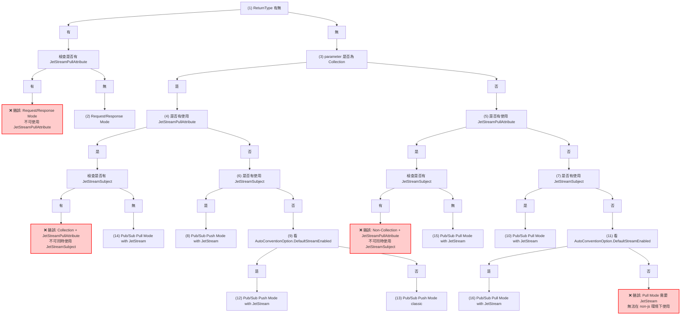

### Auto-Convention Decision Tree

```mermaid
flowchart TD
    A["(1) ReturnType 有無"] --> B["有"]
    A --> C["無"]
    
    B --> B1["檢查是否有 JetStreamPullAttribute"]
    B1 --> B2["有"]
    B1 --> B3["無"]
    B2 --> ERROR1["❌ 錯誤: Request/Response Mode<br/>不可使用 JetStreamPullAttribute"]
    B3 --> D["(2) Request/Response Mode"]
    
    C --> E["(3) parameter 是否為 Collection"]
    E --> F["是"]
    E --> G["否"]
    
    F --> H["(4) 是否有使用 JetStreamPullAttribute"]
    H --> I["是"]
    H --> J["否"]
    
    G --> K["(5) 是否有使用 JetStreamPullAttribute"]
    K --> L["是"]
    K --> M["否"]
    
    I --> I1["檢查是否有 JetStreamSubject"]
    I1 --> I2["有"]
    I1 --> I3["無"]
    I2 --> ERROR2["❌ 錯誤: Collection + JetStreamPullAttribute<br/>不可同時使用 JetStreamSubject"]
    I3 --> N["(14) Pub/Sub Pull Mode with JetStream"]
    
    J --> O["(6) 是否有使用 JetStreamSubject"]
    O --> P["是"]
    O --> Q["否"]
    
    L --> L1["檢查是否有 JetStreamSubject"]
    L1 --> L2["有"]
    L1 --> L3["無"]
    L2 --> ERROR3["❌ 錯誤: Non-Collection + JetStreamPullAttribute<br/>不可同時使用 JetStreamSubject"]
    L3 --> R["(15) Pub/Sub Pull Mode with JetStream"]
    
    M --> S["(7) 是否有使用 JetStreamSubject"]
    S --> T["是"]
    S --> U["否"]
    
    P --> V["(8) Pub/Sub Push Mode with JetStream"]
    
    Q --> W["(9) 看 AutoConventionOption.DefaultStreamEnabled"]
    W --> X["是"]
    W --> Y["否"]
    
    T --> Z["(10) Pub/Sub Pull Mode with JetStream"]
    
    U --> AA["(11) 看 AutoConventionOption.DefaultStreamEnabled"]
    AA --> BB["是"]
    AA --> CC["否"]
    
    X --> DD["(12) Pub/Sub Push Mode with JetStream"]
    Y --> EE["(13) Pub/Sub Push Mode classic"]
    BB --> FF["(16) Pub/Sub Pull Mode with JetStream"]
    CC --> ERROR4["❌ 錯誤: Pull Mode 需要 JetStream<br/>無法在 non-js 環境下使用"]
    
    classDef errorStyle fill:#ffcccc,stroke:#ff0000,stroke-width:2px
    class ERROR1,ERROR2,ERROR3,ERROR4 errorStyle
```
